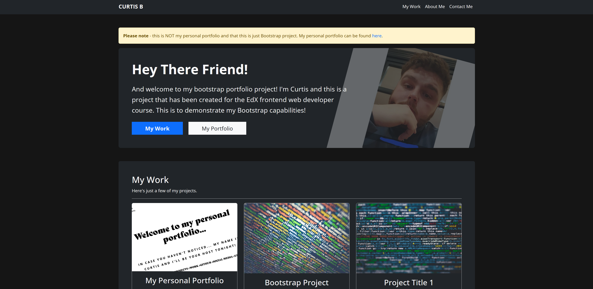
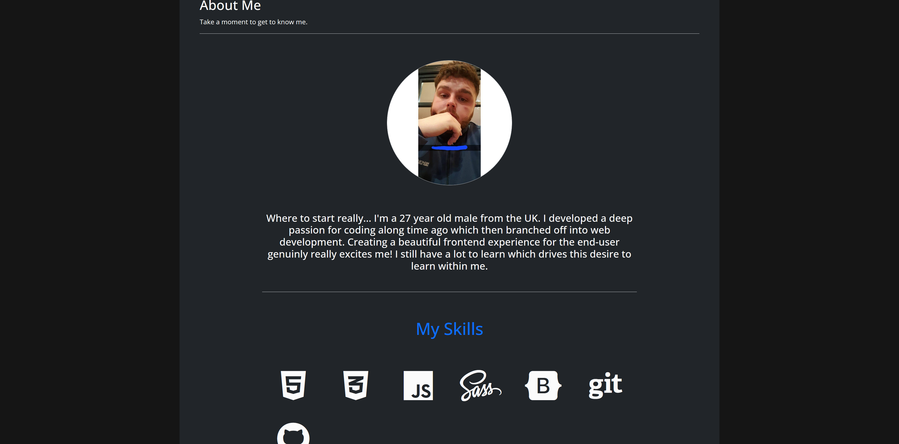
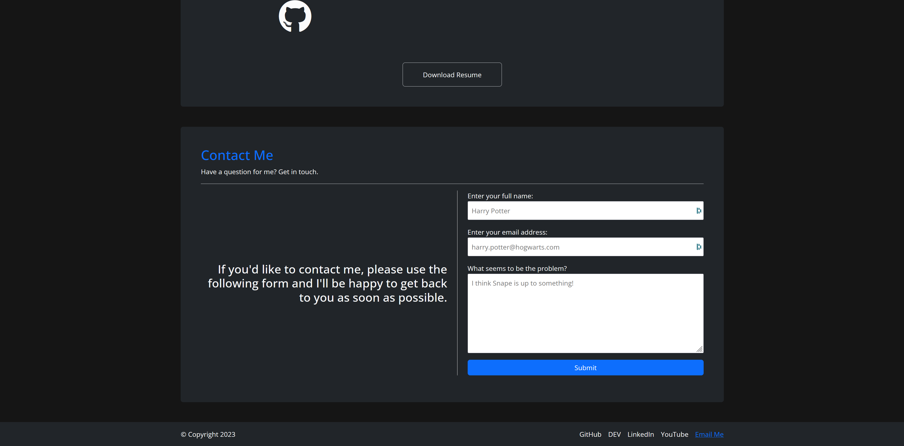

# <Your-Project-Title>

## Description

This project was created to demonstrate my capabilities and knowledge of Bootstrap. Recreating a portfolio using the technology and adding it to my personaly portfolio so future visitors can see 'where I was' to 'where I have come'.

Along the way, this project taught me a whole lot about Bootstrap and just how useful it can be once you start to understand it. Using Bootstrap helped me save time since it gave me quick and easy access to premade component such as cards and access to their grid system to easiliy style my webpage.

Here's the live demo hosted on GitHub pages: https://mvpcurtis.github.io/bootstrap-portfolio/#contactme

## Screenshots

## Credits

List your collaborators, if any, with links to their GitHub profiles.

If you used any third-party assets that require attribution, list the creators with links to their primary web presence in this section.

If you followed tutorials, include links to those here as well.

## License

MIT License

Copyright (c) [2023] [Curtis Bowen]

Permission is hereby granted, free of charge, to any person obtaining a copy
of this software and associated documentation files (the "Software"), to deal
in the Software without restriction, including without limitation the rights
to use, copy, modify, merge, publish, distribute, sublicense, and/or sell
copies of the Software, and to permit persons to whom the Software is
furnished to do so, subject to the following conditions:

The above copyright notice and this permission notice shall be included in all
copies or substantial portions of the Software.

THE SOFTWARE IS PROVIDED "AS IS", WITHOUT WARRANTY OF ANY KIND, EXPRESS OR
IMPLIED, INCLUDING BUT NOT LIMITED TO THE WARRANTIES OF MERCHANTABILITY,
FITNESS FOR A PARTICULAR PURPOSE AND NONINFRINGEMENT. IN NO EVENT SHALL THE
AUTHORS OR COPYRIGHT HOLDERS BE LIABLE FOR ANY CLAIM, DAMAGES OR OTHER
LIABILITY, WHETHER IN AN ACTION OF CONTRACT, TORT OR OTHERWISE, ARISING FROM,
OUT OF OR IN CONNECTION WITH THE SOFTWARE OR THE USE OR OTHER DEALINGS IN THE
SOFTWARE.
